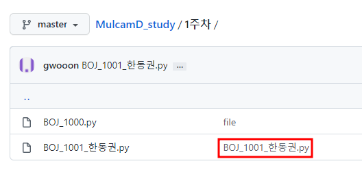
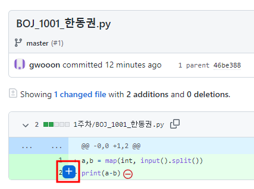
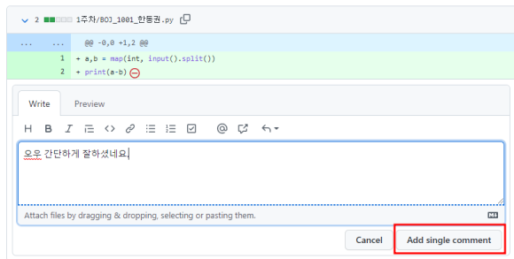
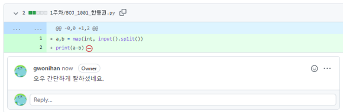

## MulcamD_study 2022

2022.01.03 ~ 현재

스터디는 2월 18일 기준으로 시작합니다.

### Rule

- 스터디 시간:
- 일주일 동안 oo문제
- 교재: ooo


### How to Contribute

##### 그룹장님이 해주셔야 할일

1. 매주 주차를 표시한 **새 디렉터리**를 생성합니다.(ex. 1주차, 2주차 ...)
2. **주차 디렉터리**에 **문제 디렉터리**를 또 만듭니다. (ex. 백준 1000번 문제라면, BOJ_1000)

---

그룹원분들이 지켜주셔야 할일

1. 파일 생성

**파일명**을 정하실 때, 백준 1000번 문제라면 **BOJ_1000_한동권.py** 와 같이 생성합니다.


2. Push 규칙

push를 진행하시기 전에 **반드시 pull 부터 진행**합니다.

``` bash
git pull <remote 이름> master
```

<remote 이름> 에는 저희가 forked Repository 와 원본 Repository 를 분류하여 지정하였고, 지금은 원본 Repository의 파일을 가져오는 것이므로 upstream 으로 pull 하시면 됩니다.

파일명은 반드시 1번의 규칙을 지켜주세요.

```bash
git add .
git commit -m 'BOJ_1000_한동권'   #commit하실때도 파일명과 같게 해주시면 됩니다.
git push <remote 이름> master
```

push할 때, conflict 생길 경우 pull을 진행하였는지 확인해주시기 바랍니다. 

### :star: 주의사항 :star:

**반드시 최상단 폴더에서 add, commit, push를 해주시기 바랍니다!!!!**


### How to Code Review

Commit History로 리뷰하는 방법

1. Git hub에서 연습파일을 올린 폴더로 들어갑니다.

   그러면 아래와 같은 화면이 나오는데 commit message(빨간박스)를 클릭해 줍니다.




2. 작성한 코드에 마우스를 올리면  `+`  버튼이 나타납니다. 

   버튼을 클릭해 줍니다.




3. 버튼을 클릭하면 다음과 같이 코멘트를 남길 수 있는 창이 생깁니다.

   피드백하고싶은 내용을 적고 `Add single comment` 를 클릭해 줍니다.




4. 위의 절차대로 진행하면 아래와 같이 피드백이 잘 남겨진 것을 확인할 수 있습니다.




---

이렇게 commit message 를 이용하여 코맨트를 남길 수도 있고 Discord 를 이용하면 화면을 보고 음성으로 대화 할 수 있어서 이를 이용해서 스터디를 진행하는 것도 괜찮을 것 같습니다. 더 좋은 아이디어가 있으시면 공유해 주시기 바랍니다!